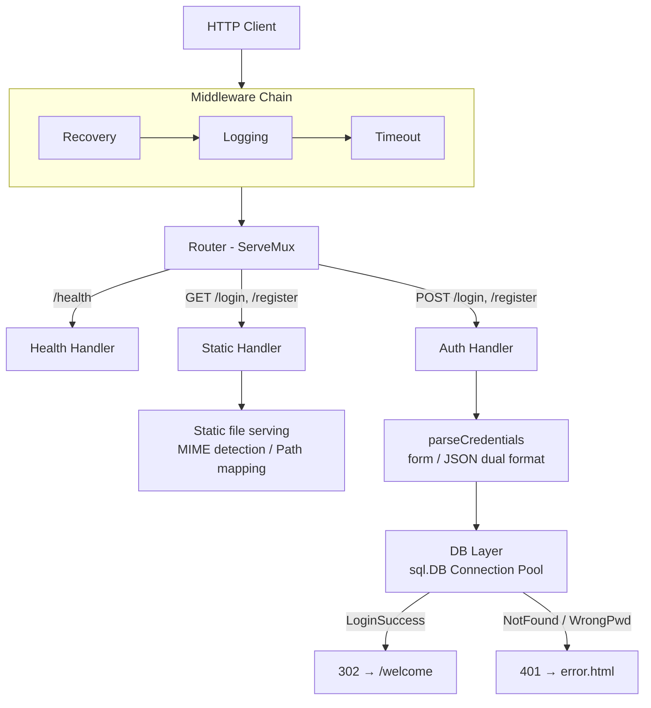
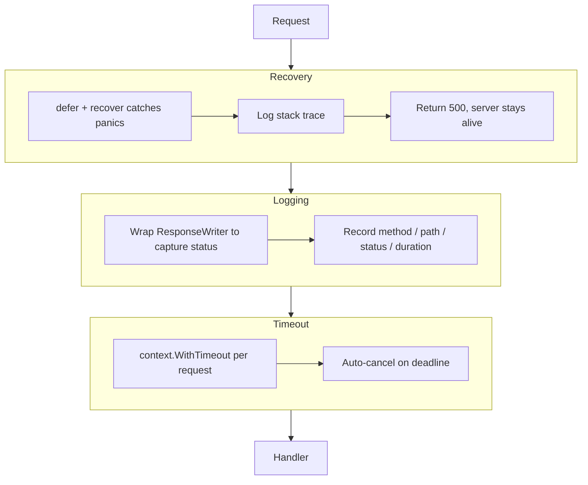
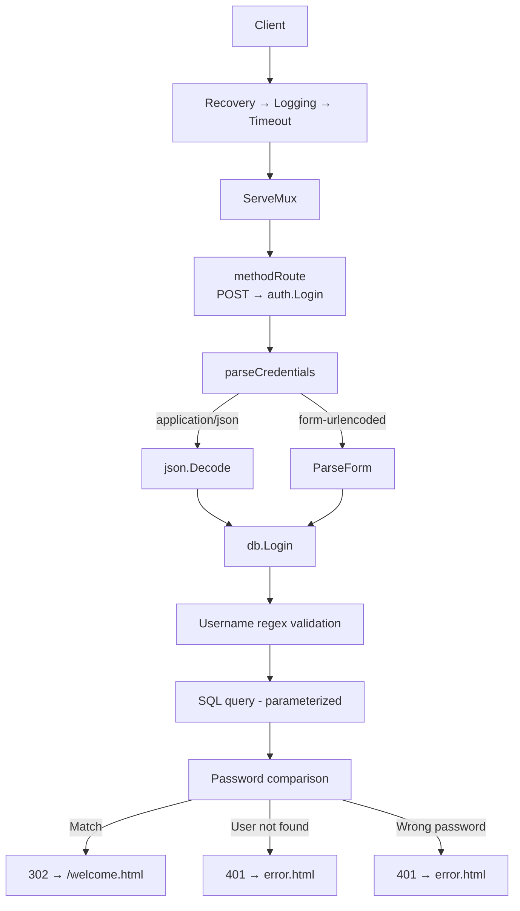

<p align="center">
  <a href="README.md">中文</a> | <a href="README-en.md">English</a>
</p>

<h1 align="center">Go-WebServer</h1>

<p align="center">
  <strong>A lightweight HTTP web server built with Go standard library</strong>
  <br />
  <em>Middleware chain · User auth · Async logging · Connection pool · Docker deployment</em>
</p>

<p align="center">
  <a href="#quick-start"></a>
  <a href="LICENSE"></a>
</p>

<p align="center">
  
  
  
</p>

---

## Features

- **Zero framework dependency** — Built entirely on `net/http` standard library
- **Middleware chain architecture** — Recovery → Logging → Timeout, single responsibility, extensible
- **Async file logging** — Channel-based non-blocking writes with buffered periodic flush
- **User authentication** — Login/register with MySQL connection pool, form and JSON support
- **Graceful shutdown** — Signal handling, connection draining, cross-platform (Linux/Windows)
- **Docker deployment** — Dockerfile + Docker Compose orchestration, ready to use

## Quick Start

### Prerequisites

- Go 1.24+
- MySQL 5.7+

### 1. Initialize the database

```bash
mysql -u root -p < init.sql
```

### 2. Edit configuration

```bash
vim config.conf
```

Key settings:

| Key | Default | Description |
|-----|---------|-------------|
| `port` | `9999` | Listen port |
| `db_host` | `127.0.0.1` | MySQL host |
| `db_user` | `root` | MySQL user |
| `db_password` | `password` | MySQL password |
| `db_name` | `webserver` | Database name |

### 3. Build and run

```bash
go run ./cmd/server/
```

### 4. Verify

```bash
curl http://localhost:9999/health
# → healthy
```

## Usage

### CLI Flags

```bash
./webserver -config config.conf -p 8080
```

| Flag | Default | Description |
|------|---------|-------------|
| `-config` | `config.conf` | Configuration file path |
| `-p` | `0` (use config) | Override listen port |

### API Endpoints

| Method | Path | Description |
|--------|------|-------------|
| GET | `/` | Serve index page |
| GET | `/login` | Login page |
| POST | `/login` | Authenticate (form or JSON) |
| GET | `/register` | Registration page |
| POST | `/register` | Create user (form or JSON) |
| GET | `/health` | Health check → `200 healthy` |

### Authentication Example

```bash
# Form-based
curl -X POST http://localhost:9999/login \
  -d "username=admin&password=admin123"

# JSON-based
curl -X POST http://localhost:9999/login \
  -H "Content-Type: application/json" \
  -d '{"username":"admin","password":"admin123"}'
```

## Architecture

### Overall Architecture



### Directory Structure

```
Go-WebServer/
├── cmd/server/              Application entry point
│   └── main.go              Startup: config → logger → server
├── internal/
│   ├── config/              Configuration parsing
│   │   └── config.go        key=value parser with defaults
│   ├── db/                  Data layer
│   │   └── mysql.go         Connection pool, login/register queries
│   ├── handler/             Route handlers
│   │   ├── auth.go          Authentication logic
│   │   ├── health.go        Health check endpoint
│   │   └── static.go        Static file serving, MIME detection
│   ├── log/                 Logging system
│   │   └── logger.go        Async slog handler, channel buffering
│   ├── middleware/           Middleware
│   │   ├── logging.go       Request logging
│   │   ├── recovery.go      Panic recovery → 500
│   │   └── timeout.go       Request timeout control
│   └── server/              Server core
│       ├── server.go        DI, route registration, lifecycle
│       ├── signal_unix.go   Linux/macOS signal handling
│       └── signal_windows.go Windows signal handling
├── resources/               Static assets (HTML/CSS/JS/images)
├── config.conf              Runtime configuration
├── init.sql                 Database initialization script
├── Dockerfile               Container image build
└── docker-compose.yml       Service orchestration (WebServer + MySQL)
```

### Middleware Chain



### Request Flow

`POST /login` example:



## Configuration

All settings are in `config.conf` (key = value format, `#` for comments).

### Network

| Key | Default | Description |
|-----|---------|-------------|
| `port` | `9999` | Listen port |
| `connection_timeout` | `60` | Read/write timeout (seconds) |

### Logging

| Key | Default | Description |
|-----|---------|-------------|
| `open_log` | `true` | Enable file logging |
| `log_file` | `log/webserver` | Log path (`.log` appended) |
| `log_level` | `1` | 0=DEBUG, 1=INFO, 2=WARN, 3=ERROR |
| `log_queue_size` | `1024` | Async channel buffer size |
| `log_flush_interval` | `3` | Force flush interval (seconds) |

### Database

| Key | Default | Description |
|-----|---------|-------------|
| `connection_pool_size` | `16` | Pool size (0 = disable DB) |
| `db_host` | `127.0.0.1` | MySQL host |
| `db_port` | `3306` | MySQL port |
| `db_user` | `root` | MySQL user |
| `db_password` | `password` | MySQL password |
| `db_name` | `webserver` | Database name |

## Tech Stack

| Layer | Technology |
|-------|------------|
| Language | Go 1.24 |
| HTTP | `net/http` (standard library) |
| Router | `http.ServeMux` |
| Middleware | Functional chain (closure nesting) |
| Logging | `log/slog` + async channel handler |
| Database | MySQL 5.7+ / `database/sql` / `go-sql-driver/mysql` |
| Container | Docker / Docker Compose |
| Frontend | Bootstrap / jQuery |

## Deployment

### Docker One-Click Deploy

```bash
docker compose up -d
```

MySQL auto-initializes, WebServer waits for database readiness.

**Container Architecture:**

```
Host:9999 → go-webserver container → mysql container:3306
```

**Common Commands:**

```bash
docker compose up -d          # Start
docker compose down            # Stop
docker compose logs -f         # View logs
docker compose restart         # Restart
```

## Contributing

1. Fork the repository
2. Create a feature branch (`git checkout -b feature/my-change`)
3. Commit your changes (`git commit -m "add my change"`)
4. Push to the branch (`git push origin feature/my-change`)
5. Open a Pull Request

## License

This project is licensed under the MIT License. See [LICENSE](LICENSE) for details.
