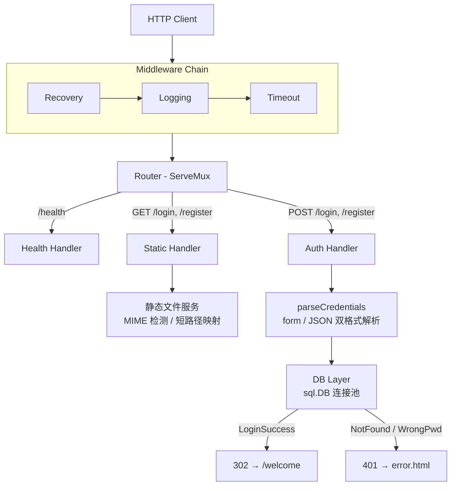
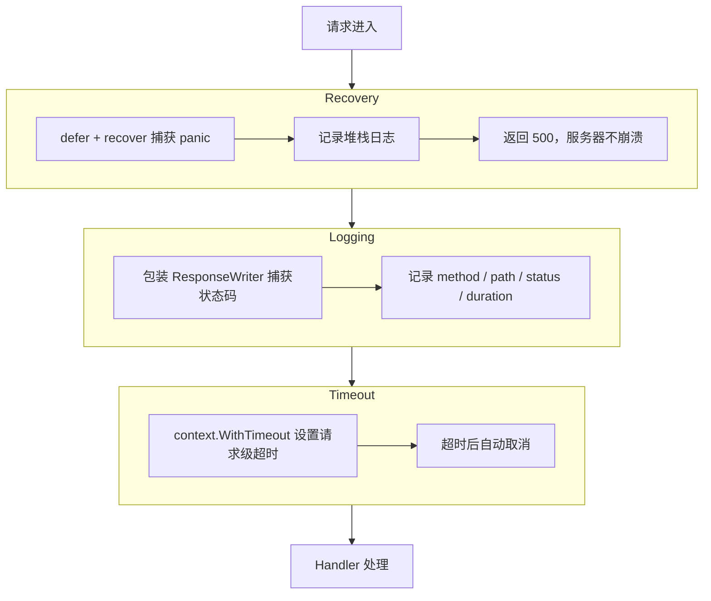
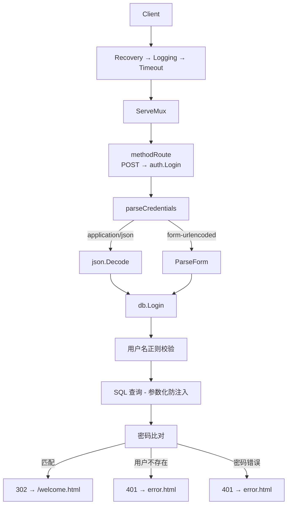

<p align="center">
  <a href="README.md">中文</a> | <a href="README-en.md">English</a>
</p>

<h1 align="center">Go-WebServer</h1>

<p align="center">
  <strong>基于 Go 标准库构建的轻量级 HTTP Web 服务器</strong>
  <br />
  <em>中间件链 · 用户认证 · 异步日志 · 连接池 · Docker 部署</em>
</p>

<p align="center">
  <a href="#快速开始"></a>
  <a href="LICENSE"></a>
</p>

<p align="center">
  
  
  
</p>

---

## 特性

- **零框架依赖** — 完全基于 `net/http` 标准库，无第三方 Web 框架
- **中间件链架构** — Recovery → Logging → Timeout，职责单一，可自由扩展
- **异步文件日志** — 基于 channel 的非阻塞写入，缓冲 + 定时刷盘
- **用户认证** — 登录注册，MySQL 连接池，支持表单和 JSON 双格式
- **优雅关闭** — 捕获系统信号，排空连接后退出，支持跨平台（Linux/Windows）
- **Docker 一键部署** — Dockerfile + Docker Compose 编排，开箱即用

## 快速开始

### 环境要求

- Go 1.24+
- MySQL 5.7+

### 1. 初始化数据库

```bash
mysql -u root -p < init.sql
```

### 2. 修改配置

```bash
vim config.conf
```

关键配置：

| 配置键 | 默认值 | 说明 |
|--------|--------|------|
| `port` | `9999` | 监听端口 |
| `db_host` | `127.0.0.1` | MySQL 主机 |
| `db_user` | `root` | MySQL 用户名 |
| `db_password` | `password` | MySQL 密码 |
| `db_name` | `webserver` | 数据库名 |

### 3. 编译运行

```bash
go run ./cmd/server/
```

### 4. 验证

```bash
curl http://localhost:9999/health
# → healthy
```

## 使用说明

### 命令行参数

```bash
./webserver -config config.conf -p 8080
```

| 参数 | 默认值 | 说明 |
|------|--------|------|
| `-config` | `config.conf` | 配置文件路径 |
| `-p` | `0`（使用配置） | 覆盖监听端口 |

### API 端点

| 方法 | 路径 | 说明 |
|------|------|------|
| GET | `/` | 返回首页 |
| GET | `/login` | 登录页面 |
| POST | `/login` | 用户认证（表单或 JSON） |
| GET | `/register` | 注册页面 |
| POST | `/register` | 创建用户（表单或 JSON） |
| GET | `/health` | 健康检查 → `200 healthy` |

### 认证示例

```bash
# 表单方式
curl -X POST http://localhost:9999/login \
  -d "username=admin&password=admin123"

# JSON 方式
curl -X POST http://localhost:9999/login \
  -H "Content-Type: application/json" \
  -d '{"username":"admin","password":"admin123"}'
```

## 架构设计

### 整体架构



### 目录结构

```
Go-WebServer/
├── cmd/server/              程序入口
│   └── main.go              启动流程：配置 → 日志 → 服务器
├── internal/
│   ├── config/              配置解析
│   │   └── config.go        key=value 格式解析，提供默认值
│   ├── db/                  数据层
│   │   └── mysql.go         连接池管理、登录/注册查询
│   ├── handler/             路由处理器
│   │   ├── auth.go          认证逻辑（登录、注册）
│   │   ├── health.go        健康检查端点
│   │   └── static.go        静态文件服务、MIME 检测
│   ├── log/                 日志系统
│   │   └── logger.go        异步 slog handler、channel 缓冲
│   ├── middleware/           中间件
│   │   ├── logging.go       请求日志（method/path/status/duration）
│   │   ├── recovery.go      panic 恢复，返回 500
│   │   └── timeout.go       请求超时控制
│   └── server/              服务器核心
│       ├── server.go        依赖注入、路由注册、生命周期管理
│       ├── signal_unix.go   Linux/macOS 信号处理
│       └── signal_windows.go Windows 信号处理
├── resources/               静态资源（HTML/CSS/JS/图片）
├── config.conf              运行配置
├── init.sql                 数据库初始化脚本
├── Dockerfile               容器镜像构建
└── docker-compose.yml       服务编排（WebServer + MySQL）
```

### 中间件链



### 请求处理流程

以 `POST /login` 为例：



## 配置说明

所有配置项位于 `config.conf`（`key = value` 格式，`#` 为注释）。

### 网络

| 配置键 | 默认值 | 说明 |
|--------|--------|------|
| `port` | `9999` | 监听端口 |
| `connection_timeout` | `60` | 读写超时（秒） |

### 日志

| 配置键 | 默认值 | 说明 |
|--------|--------|------|
| `open_log` | `true` | 启用文件日志 |
| `log_file` | `log/webserver` | 日志路径（自动追加 `.log`） |
| `log_level` | `1` | 0=DEBUG, 1=INFO, 2=WARN, 3=ERROR |
| `log_queue_size` | `1024` | 异步通道缓冲大小 |
| `log_flush_interval` | `3` | 强制刷盘间隔（秒） |

### 数据库

| 配置键 | 默认值 | 说明 |
|--------|--------|------|
| `connection_pool_size` | `16` | 连接池大小（0 = 禁用数据库） |
| `db_host` | `127.0.0.1` | MySQL 主机 |
| `db_port` | `3306` | MySQL 端口 |
| `db_user` | `root` | MySQL 用户名 |
| `db_password` | `password` | MySQL 密码 |
| `db_name` | `webserver` | 数据库名 |

## 技术栈

| 层级 | 技术 |
|------|------|
| 语言 | Go 1.24 |
| HTTP | `net/http`（标准库） |
| 路由 | `http.ServeMux` |
| 中间件 | 函数式中间件链（闭包嵌套） |
| 日志 | `log/slog` + 异步 channel handler |
| 数据库 | MySQL 5.7+ / `database/sql` / `go-sql-driver/mysql` |
| 容器 | Docker / Docker Compose |
| 前端 | Bootstrap / jQuery |

## 部署

### Docker 一键部署

```bash
docker compose up -d
```

MySQL 自动初始化，WebServer 等待数据库就绪后启动。

**容器架构：**

```
宿主机:9999 → go-webserver 容器 → mysql 容器:3306
```

**常用命令：**

```bash
docker compose up -d          # 启动
docker compose down            # 停止
docker compose logs -f         # 查看日志
docker compose restart         # 重启
```

## 贡献

1. Fork 本仓库
2. 创建功能分支（`git checkout -b feature/my-change`）
3. 提交更改（`git commit -m "add my change"`）
4. 推送分支（`git push origin feature/my-change`）
5. 提交 Pull Request

## 许可证

本项目基于 MIT 许可证开源。详见 [LICENSE](LICENSE)。
